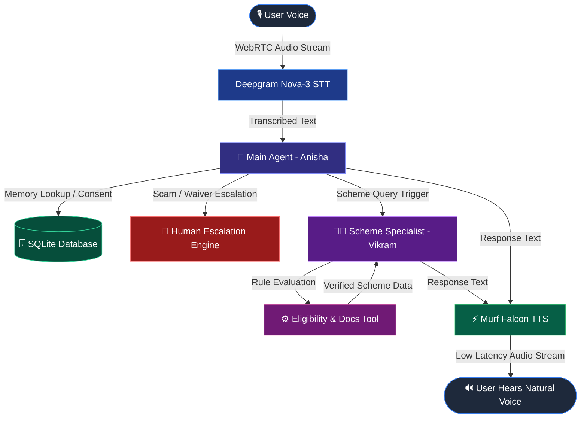

# Building a Financial Services Voice Agent in 10 Days — My VoiceForBharat Journey 🇮🇳

> **Track:** Financial Services | **Agent Name:** Voice of Bharat (Anisha & Vikram)  
> **Tech Stack:** Murf Falcon TTS, Deepgram STT, Google Gemini / OpenAI LLM, LiveKit Agents SDK, Next.js, SQLite  
> **GitHub Repo:** [https://github.com/suryamanikanta2007-oss/Voice_of_Bharat](https://github.com/suryamanikanta2007-oss/Voice_of_Bharat)

---

## 🌟 Introduction

Hi, I’m **Manikanta**! 

Over the last 10 days, I participated in **10 Days of Voice Agents — #VoiceForBharat Edition** and built an AI-powered voice agent for the **Financial Services** track called **Voice of Bharat**.

My vision was clear: create a warm, conversational AI voice assistant that helps citizens across India navigate financial services, bank processes, and government schemes through natural spoken conversations — eliminating the need to read through complex forms or navigate confusing government portals.

> 💡 **Why Voice for Bharat?**  
> For millions of people across India, speaking in their native language or conversational English is far more natural than typing or reading complex digital forms. Voice AI bridges the digital divide and makes essential financial services truly accessible to everyone.

The 10-day sprint gave me end-to-end, hands-on experience building a real-time, low-latency AI agent equipped with **tools, memory, outbound calling, human escalation, call analytics, and multi-agent specialist handoffs**.

---

## 🛑 The Problem We Are Solving

Information regarding government schemes and financial services is often fragmented across multiple websites, PDFs, and official notifications. 

A user typically struggles to find:
* 📜 **Which scheme they qualify for** (e.g., PM Kisan, Sukanya Samriddhi, Jan Dhan, Atal Pension Yojana, PM Mudra Loan)
* 📋 **What exact document checklist is required** before visiting a bank branch or CSC center
* ⚖️ **Eligibility thresholds** (age limits, annual income criteria, land ownership requirements)
* ⏰ **Approaching application deadlines**
* 🔒 **Protection against financial scams and fraudulent calls**

Searching manually requires digital literacy that many first-time users lack. 

With **Voice of Bharat**, a user simply speaks naturally:

```text
🗣️ Caller: "Namaste! Am I eligible for the PM Kisan scheme, and what documents should I carry?"
🤖 Agent (Anisha): "Namaste! I will connect you to our government scheme specialist."
👨‍💼 Specialist (Vikram): "Namaste, I am Vikram, your Government Scheme Specialist. PM Kisan provides 6,000 rupees annually for landholding farmers. You will need your Aadhaar card, bank passbook, and land ownership records."
```

---

## 🏗️ System Architecture & Real-Time Pipeline

Building a voice agent requires ultra-low latency. If the agent takes more than a second to respond, the conversation feels unnatural.

Here is the real-time pipeline powering **Voice of Bharat**:

1. 🎙️ **Speech-to-Text (STT):** **Deepgram Nova-3** transcribes real-time audio input with high accuracy for Indian accents.
2. 🧠 **LLM Reasoning:** **Google Gemini / OpenAI** processes conversation context, evaluates guardrails, and decides tool execution or agent handoff.
3. ⚡ **Text-to-Speech (TTS):** **Murf Falcon** — the fastest streaming TTS API — generates natural, warm Indian voice responses with sub-100ms latency.
4. 🔄 **Real-Time Transport:** **LiveKit Agents SDK** manages WebRTC audio streaming, turn detection (Silero VAD), and state management.



---

## 🔥 Key Features Built Across the 10 Days

### 1. 🎙️ Natural Indian Voice with Murf Falcon
Using **Murf Falcon**, response generation feels instantaneous and natural. The warm Indian voice profile builds immediate trust with callers.

### 2. 🛡️ Strict Financial Guardrails & Prompt Rules
Financial AI agents must be safe and accurate. Key guardrails enforced:
* **Concise Spoken Output:** Responses are limited to 2–3 plain sentences. No markdown symbols, bullet points, or list formatting.
* **Plain Spoken Currency:** Currency is spoken as plain words ("rupees" or "lakh rupees") instead of symbols (`₹` or `$`).
* **Strict Privacy Guardrail:** The agent **NEVER** asks for, records, or stores passwords, PINs, OTPs, Aadhaar numbers, or bank account credentials.

### 3. 🖥️ Visual Agent States Frontend
Built with Next.js and LiveKit UI components, the web interface gives real-time visual feedback:
`Ready` ➡️ `Connecting` ➡️ `Listening` ➡️ `Speaking` ➡️ `Call Ended`

### 4. 🧠 Returning Caller Memory (With Explicit Consent)
The agent remembers returning users across calls using an SQLite backend (`db.py`):
* The agent explicitly asks: *"May I save your name and what we discussed today so I can remember it for your next call?"*
* Upon consent, caller preferences and previous scheme inquiries are saved and warmly greeted on their next call.

```text
🤖 Anisha: "Namaste Ramesh, welcome back! Last time we discussed cotton crop spraying and PM Kisan eligibility. How can I help you today?"
```

### 5. ⚙️ Scheme Eligibility & Document Checker Tool
Instead of halluncinating rules, the agent calls a deterministic tool (`evaluate_eligibility`) that checks verified offline criteria for major schemes:
* **PM Kisan Samman Nidhi**
* **Sukanya Samriddhi Yojana**
* **Pradhan Mantri Jan Dhan Yojana**
* **Atal Pension Yojana**
* **PM Mudra Loan**

### 6. 📞 Outbound Deadline Reminder Calls
Using telephony integration (Twilio / Linphone / SIP), the agent places outbound calls to remind registered farmers and citizens about upcoming scheme submission deadlines.

### 7. 🚨 Human Escalation Engine
When a caller reports financial fraud/scams or requests special loan waivers:
* The agent reassures the caller calmly.
* Asks for explicit permission to log a support request.
* Generates a unique tracking reference (e.g., `ESC-84920`) and promises a follow-up within 24 hours.

### 8. 📊 Integrated Call Analytics Dashboard
A real-time dashboard (`/dashboard`) tracks total calls, resolution success rates, scheme inquiry distributions, and pending escalations.

### 9. 🤖 Multi-Agent Specialist Handoff (Anisha ➡️ Vikram)
One of my favorite features! When a caller asks detailed scheme eligibility or document questions:
* **Anisha** (Main Helpline Agent) announces the transfer out loud.
* Handoff tool transfers control to **Vikram** (Government Scheme Specialist).
* Vikram seamlessly introduces himself and addresses the caller's specific question using conversation history without asking the user to repeat themselves.

---

## 🛠️ Code Snippets & Implementation Highlights

### 1. Specialist Handoff Tool (`agent.py`)

```python
@function_tool
async def transfer_to_scheme_specialist(self, context: RunContext) -> str:
    """Transfer the conversation to Vikram, the Government Scheme Specialist."""
    logger.info("Transferring conversation to Government Scheme Specialist (Vikram)")
    context.session.agent = scheme_specialist_instance
    return (
        "Transferred conversation to Government Scheme Specialist Vikram. "
        "Vikram will now introduce himself and assist the caller."
    )
```

### 2. Scheme Rule Evaluation Engine (`scheme_data.py`)

```python
def evaluate_eligibility(scheme_query: str, applicant_age: int = None, **kwargs) -> dict:
    """Evaluates scheme criteria against verified 2026 government records."""
    # Deterministic evaluation without LLM hallucination
    scheme = match_scheme(scheme_query)
    return {
        "status": "QUALIFIED" if is_eligible else "NOT_ELIGIBLE",
        "scheme_name": scheme["name"],
        "required_documents": scheme["documents"],
        "benefits_summary": scheme["benefits"]
    }
```

---

## 🚀 How to Run the Project Locally

### Prerequisites
* **Python 3.10+** with `uv` package manager
* **Node.js 18+** & `pnpm`
* LiveKit, Murf AI, Deepgram, and Gemini API keys

### Step 1: Clone the repository
```bash
git clone https://github.com/suryamanikanta2007-oss/Voice_of_Bharat.git
cd Voice_of_Bharat
```

### Step 2: Configure Environment Variables
Create `.env.local` in `backend/` and `frontend/`:
```env
LIVEKIT_URL=wss://your-livekit-instance.cloud
LIVEKIT_API_KEY=your_livekit_api_key
LIVEKIT_API_SECRET=your_livekit_api_secret
MURF_API_KEY=your_murf_falcon_api_key
DEEPGRAM_API_KEY=your_deepgram_api_key
GOOGLE_API_KEY=your_gemini_api_key
```

### Step 3: Launch All Services

**Windows PowerShell:**
```powershell
.\start_app.ps1
```

**macOS / Linux:**
```bash
./start_app.sh
```

Navigate to `http://localhost:3000` in your browser and click **Start Talking**!

---

## 🔗 Project & Demo Links

* 💻 **GitHub Repository:**  
  [https://github.com/suryamanikanta2007-oss/Voice_of_Bharat](https://github.com/suryamanikanta2007-oss/Voice_of_Bharat)

* 🎬 **Specialist Handoff & Voice Agent Demo (LinkedIn):**  
  [Watch Day 9 Demo Video on LinkedIn](https://www.linkedin.com/posts/manikanta2007_voiceforbharat-murfai-voiceai-activity-7494080289468682241-4769?utm_source=social_share_send&utm_medium=member_desktop_web&rcm=ACoAAGvHS2oBuUKD5pVFrbfjdEJoXAaEVmv7qDc)

* 📊 **Analytics Dashboard:**  
  `http://localhost:3000/dashboard`

---

## 💡 Lessons Learned & Key Takeaways

1. **Tool Descriptions Matter:** Clear docstrings in `@function_tool` are essential so LLMs invoke tools at the exact right moment with clean parameters.
2. **Latency is King:** Combining low-latency STT (Deepgram), streaming LLM tokens, and ultra-fast TTS (**Murf Falcon**) makes real-time voice conversations feel truly human.
3. **Focused Agents Over Monoliths:** Dividing responsibilities between a general helpline agent (Anisha) and a domain specialist (Vikram) yields far higher reliability and cleaner prompt engineering.

---

## 🎯 What's Next for Voice of Bharat?

* 🇮🇳 **Multi-Lingual Expansion:** Adding native support for Telugu, Hindi, and regional code-mixed speech.
* 📱 **WhatsApp Voice Note Integration:** Enabling citizens to send voice queries via WhatsApp and receive instant voice note answers.
* 📜 **Direct Application Processing:** Helping users fill out scheme application forms via step-by-step voice guidance.

---

## 🏷️ Hashtags & Tags

#VoiceForBharat #MurfAI #LiveKit #VoiceAI #GenerativeAI #Python #Nextjs #AIForGood #TechForBharat #VoiceAgents

---

*Built with ❤️ by Manikanta for the 10 Days of Voice Agents — VoiceForBharat Challenge.*
